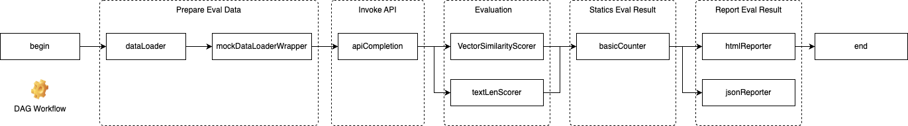

#  EvalFox

##### 📖 English Documentation | 📖 [中文文档](README_zh_CN.md)

## Overview

An AI automation evaluation framework based on Java, featuring:

- Full evaluation workflow orchestration: Quickly implement data construction, evaluation execution, result reporting and output, and evaluation summary processes.
- Extensibility: In addition to built-in system nodes, custom nodes can be extended.
- High performance: Based on DAG (Directed Acyclic Graph) implementation, supports multithreaded execution of DAG nodes.
- LLM support: Enables rapid integration of LLM (Large Language Model) services.
- Minimal dependencies: Requires few framework dependencies, does not rely on Spring, and can be quickly integrated into other Java projects.
- Full/Delta Eval: Supports full and delta evaluation. Supports evaluation on full datasets as well as delta evaluation. Delta evaluation also supports resuming evaluation from breakpoints.

## Quick Start

### Tool Preparation

Before you begin, please install the following tools:
- JDK 1.8+
- Maven 3.x

### Add Dependencies

```xml
<dependency>
    <groupId>io.github.zendodx</groupId>
    <artifactId>eval-fox-eval</artifactId>
    <version>0.1.1</version>
</dependency>
```

### Prepare Evaluation Orchestration

#### Raw DAG Evaluation

Below is an example of an evaluation orchestration for assessing similarity and text length.




```java
package com.evalkit.framework.example.basic;

import com.evalkit.framework.common.utils.file.FileUtils;
import com.evalkit.framework.common.utils.list.ListUtils;
import com.evalkit.framework.common.utils.map.MapUtils;
import com.evalkit.framework.common.utils.time.DateUtils;
import com.evalkit.framework.eval.model.ApiCompletionResult;
import com.evalkit.framework.eval.model.DataItem;
import com.evalkit.framework.eval.model.InputData;
import com.evalkit.framework.eval.model.ScorerResult;
import com.evalkit.framework.eval.node.api.ApiCompletion;
import com.evalkit.framework.eval.node.begin.Begin;
import com.evalkit.framework.eval.node.counter.BasicCounter;
import com.evalkit.framework.eval.node.dataloader.DataLoader;
import com.evalkit.framework.eval.node.dataloader_wrapper.MockDataLoaderWrapper;
import com.evalkit.framework.eval.node.end.End;
import com.evalkit.framework.eval.node.reporter.JsonReporter;
import com.evalkit.framework.eval.node.reporter.Reporter;
import com.evalkit.framework.eval.node.reporter.html.HtmlReporter;
import com.evalkit.framework.eval.node.scorer.Scorer;
import com.evalkit.framework.eval.node.scorer.VectorSimilarityScorer;
import com.evalkit.framework.eval.node.scorer.config.ScorerConfig;
import com.evalkit.framework.workflow.WorkflowBuilder;
import com.evalkit.framework.workflow.model.WorkflowContext;
import lombok.extern.slf4j.Slf4j;
import org.apache.commons.lang3.StringUtils;
import org.apache.commons.lang3.tuple.ImmutablePair;
import org.apache.commons.lang3.tuple.Pair;
import org.junit.jupiter.api.BeforeEach;
import org.junit.jupiter.api.Test;

import java.io.File;
import java.io.IOException;
import java.util.List;
import java.util.stream.Collectors;

@Slf4j
public class BasicEvalTest {

    Begin begin;
    DataLoader dataLoader;
    MockDataLoaderWrapper mockDataLoaderWrapper;
    ApiCompletion apiCompletion;
    VectorSimilarityScorer vectorSimilarityScorer;
    Scorer textLenScorer;
    BasicCounter basicCounter;
    HtmlReporter htmlReporter;
    JsonReporter jsonReporter;
    End end;

    @BeforeEach
    public void init() {
        begin = new Begin();

        dataLoader = new DataLoader() {
            @Override
            public List<InputData> prepareDataList() throws Exception {
                return ListUtils.of(
                        new InputData(MapUtils.of("query", "{{holiday}} go to Shanghai", "groundTruth", "The travel to Shanghai"))
                );
            }
        };

        mockDataLoaderWrapper = new MockDataLoaderWrapper() {
            @Override
            public List<String> selectMockFields() {
                return ListUtils.of("query");
            }
        };

        apiCompletion = new ApiCompletion() {
            @Override
            protected ApiCompletionResult invoke(DataItem dataItem) throws IOException {
                ApiCompletionResult result = new ApiCompletionResult();
                result.setResultItem(MapUtils.of("response", "Ok, A travel to Shanghai to you"));
                return result;
            }
        };

        vectorSimilarityScorer = new VectorSimilarityScorer(
                ScorerConfig.builder()
                        .metricName("SimilarityEval")
                        .threshold(1)
                        .build(),
                0.5
        ) {
            @Override
            public Pair<String, String> prepareFieldPair(DataItem dataItem) {
                return new ImmutablePair<>("groundTruth", "response");
            }
        };

        textLenScorer = new Scorer(
                ScorerConfig.builder()
                        .metricName("TextLenEval")
                        .threshold(1)
                        .build()
        ) {
            @Override
            public ScorerResult eval(DataItem dataItem) throws Exception {
                ApiCompletionResult apiCompletionResult = dataItem.getApiCompletionResult();
                String response = apiCompletionResult.get("response");
                ScorerResult scorerResult = new ScorerResult();
                if (StringUtils.length(response) >= 5) {
                    scorerResult.setScore(1);
                    scorerResult.setReason("Length greater than 5, meets expectations.");
                } else {
                    scorerResult.setScore(0);
                    scorerResult.setReason("Length less than 5, does not meet expectations.");
                }
                return scorerResult;
            }
        };

        basicCounter = new BasicCounter();

        String fileName = "BasicEval_" + DateUtils.nowToString();
        String parentDir = "attaches/" + fileName;
        htmlReporter = new HtmlReporter(fileName, parentDir);
        jsonReporter = new JsonReporter(fileName, parentDir);

        end = new End() {
            @Override
            public void process(WorkflowContext workflowContext) {
                List<File> files = FileUtils.listFiles(parentDir);
                log.info("Attachment list: {}", files.stream().map(File::getAbsolutePath).collect(Collectors.toList()));
                S3Service s3Service = new S3Service();
                for (File file : files) {
                    s3Service.uploadFile("test", file.getName(), file);
                }
            }
        };
    }

    @Test
    public void test() {
        List<Scorer> scorers = ListUtils.of(vectorSimilarityScorer, textLenScorer);
        List<Reporter> reporters = ListUtils.of(htmlReporter, jsonReporter);
        new WorkflowBuilder()
                .link(begin, dataLoader, mockDataLoaderWrapper, apiCompletion)
                .link(apiCompletion, scorers)
                .link(scorers, basicCounter)
                .link(basicCounter, reporters)
                .link(reporters, end)
                .build()
                .execute();
    }
}
```

#### Full Evaluation

```java
package com.evalkit.framework.eval.facade;

import com.evalkit.framework.common.utils.file.FileUtils;
import com.evalkit.framework.common.utils.list.ListUtils;
import com.evalkit.framework.common.utils.map.MapUtils;
import com.evalkit.framework.common.utils.time.DateUtils;
import com.evalkit.framework.eval.model.ApiCompletionResult;
import com.evalkit.framework.eval.model.DataItem;
import com.evalkit.framework.eval.model.InputData;
import com.evalkit.framework.eval.model.ScorerResult;
import com.evalkit.framework.eval.node.api.ApiCompletion;
import com.evalkit.framework.eval.node.begin.Begin;
import com.evalkit.framework.eval.node.begin.config.BeginConfig;
import com.evalkit.framework.eval.node.counter.BasicCounter;
import com.evalkit.framework.eval.node.dataloader.DataLoader;
import com.evalkit.framework.eval.node.dataloader.MultiDataLoader;
import com.evalkit.framework.eval.node.reporter.JsonReporter;
import com.evalkit.framework.eval.node.reporter.html.HtmlReporter;
import com.evalkit.framework.eval.node.scorer.Scorer;
import com.evalkit.framework.eval.node.scorer.config.ScorerConfig;
import com.evalkit.framework.eval.node.scorer.strategy.SumScoreStrategy;
import com.evalkit.framework.workflow.Workflow;
import com.evalkit.framework.workflow.WorkflowBuilder;
import lombok.extern.slf4j.Slf4j;
import org.junit.jupiter.api.Test;

import java.io.File;
import java.util.ArrayList;
import java.util.List;
import java.util.stream.Collectors;

@Slf4j
class FullEvalFacadeTest {
    
    static class CustomFullEval extends FullEvalFacade {

        public CustomFullEval(FullEvalConfig config) {
            super(config);
        }

        @Override
        protected void afterLoadData() {
            log.info("===>Finish load data, data size:{}", getRemainDataCount());
        }

        @Override
        protected void afterExecute() {
            log.info("===>Finish consume and eval, remain data size:{}, processed data size:{}", getRemainDataCount(), getProcessedDataCount());
            List<File> files = FileUtils.listFiles("attaches/");
            List<String> collect = files.stream().map(File::getName).collect(Collectors.toList());
            log.info("===>attaches files:{}", collect);
        }
    }

    @Test
    public void test() throws Exception {
        DataLoader dataLoader1 = new DataLoader() {
            @Override
            public List<InputData> prepareDataList() throws Exception {
                return ListUtils.of(
                        new InputData(MapUtils.of("query", "1")),
                        new InputData(MapUtils.of("query", "2"))
                );
            }
        };
        DataLoader dataLoader2 = new DataLoader() {
            @Override
            public List<InputData> prepareDataList() throws Exception {
                List<InputData> inputDataList = new ArrayList<>();
                for (int i = 0; i < 100; i++) {
                    inputDataList.add(new InputData(MapUtils.of("query", "" + i)));
                }
                return inputDataList;
            }
        };
        MultiDataLoader multiDataLoader = new MultiDataLoader(ListUtils.of(dataLoader1, dataLoader2), 10, 100);

        Begin begin = new Begin(
                BeginConfig.builder()
                        .threshold(1)
                        .scoreStrategy(new SumScoreStrategy())
                        .build()
        );
        ApiCompletion apiCompletion = new ApiCompletion() {
            @Override
            protected ApiCompletionResult invoke(DataItem dataItem) throws InterruptedException {
                ApiCompletionResult result = new ApiCompletionResult();
                result.setResultItem(MapUtils.of("response", "Resp of " + dataItem.getInputData().get("query")));
                return result;
            }
        };
        Scorer scorer1 = new Scorer() {
            @Override
            public ScorerResult eval(DataItem dataItem) {
                ScorerResult scorerResult = new ScorerResult();
                scorerResult.setMetric("eval-test-1");
                scorerResult.setScore(1.0);
                scorerResult.setReason("eval test1:" + dataItem.getInputData().get("query"));
                return scorerResult;
            }
        };
        Scorer scorer2 = new Scorer(
                ScorerConfig.builder()
                        .star(true)
                        .threshold(1)
                        .metricName("eval-test-2")
                        .build()
        ) {
            @Override
            public ScorerResult eval(DataItem dataItem) {
                ScorerResult scorerResult = new ScorerResult();
                scorerResult.setMetric("eval-test-2");
                scorerResult.setScore(1.0);
                scorerResult.setReason("eval test1:" + dataItem.getInputData().get("query"));
                return scorerResult;
            }
        };
        Scorer scorer3 = new Scorer() {
            @Override
            public ScorerResult eval(DataItem dataItem) {
                ScorerResult scorerResult = new ScorerResult();
                scorerResult.setMetric("eval-test-3");
                scorerResult.setScore(0);
                scorerResult.setReason("eval test3:" + dataItem.getInputData().get("query"));
                return scorerResult;
            }
        };

        String fileName = "full_eval_test_" + DateUtils.nowToString();
        BasicCounter basicCounter = new BasicCounter();
        HtmlReporter htmlReporter = new HtmlReporter(fileName);
        JsonReporter jsonReporter = new JsonReporter(fileName);

        List<Scorer> scorers = ListUtils.of(scorer1, scorer2, scorer3);

        Workflow evalWorkflow = new WorkflowBuilder()
                .link(begin, apiCompletion)
                .link(apiCompletion, scorers).build();
        Workflow reportWorkflow = new WorkflowBuilder()
                .link(basicCounter, htmlReporter, jsonReporter).build();

        CustomFullEval cfe = new CustomFullEval(
                FullEvalConfig.builder()
                        .taskName("FullEvalTest")
                        .dataLoader(multiDataLoader)
                        .evalWorkflow(evalWorkflow)
                        .reportWorkflow(reportWorkflow)
                        .build()
        );
        cfe.run();
    }

}
```

#### Delta Evaluation

```java
package com.evalkit.framework.eval.facade;

import com.evalkit.framework.common.utils.file.FileUtils;
import com.evalkit.framework.common.utils.list.ListUtils;
import com.evalkit.framework.common.utils.map.MapUtils;
import com.evalkit.framework.common.utils.time.DateUtils;
import com.evalkit.framework.eval.model.ApiCompletionResult;
import com.evalkit.framework.eval.model.DataItem;
import com.evalkit.framework.eval.model.InputData;
import com.evalkit.framework.eval.model.ScorerResult;
import com.evalkit.framework.eval.node.api.ApiCompletion;
import com.evalkit.framework.eval.node.begin.Begin;
import com.evalkit.framework.eval.node.begin.config.BeginConfig;
import com.evalkit.framework.eval.node.counter.BasicCounter;
import com.evalkit.framework.eval.node.dataloader.DataLoader;
import com.evalkit.framework.eval.node.dataloader.MultiDataLoader;
import com.evalkit.framework.eval.node.reporter.JsonReporter;
import com.evalkit.framework.eval.node.reporter.html.HtmlReporter;
import com.evalkit.framework.eval.node.scorer.Scorer;
import com.evalkit.framework.eval.node.scorer.config.ScorerConfig;
import com.evalkit.framework.eval.node.scorer.strategy.SumScoreStrategy;
import com.evalkit.framework.workflow.Workflow;
import com.evalkit.framework.workflow.WorkflowBuilder;
import lombok.extern.slf4j.Slf4j;
import org.junit.jupiter.api.Test;

import java.io.File;
import java.util.ArrayList;
import java.util.List;
import java.util.stream.Collectors;

@Slf4j
class DeltaEvalFacadeTest {
    
    static class CustomDeltaEval extends DeltaEvalFacade {

        public CustomDeltaEval(DeltaEvalConfig config) {
            super(config);
        }

        @Override
        protected void afterLoadData() {
            log.info("===>Finish load data, data size:{}", getRemainDataCount());
        }

        @Override
        protected void afterExecute() {
            log.info("===>Finish consume and eval, remain data size:{}, processed data size:{}", getRemainDataCount(), getProcessedDataCount());
            List<File> files = FileUtils.listFiles("attaches/");
            List<String> collect = files.stream().map(File::getName).collect(Collectors.toList());
            log.info("===>attaches files:{}", collect);
        }
    }

    @Test
    public void test() throws Exception {
        // 评测数据加载器
        DataLoader dataLoader1 = new DataLoader() {
            @Override
            public List<InputData> prepareDataList() {
                return ListUtils.of(
                        new InputData(MapUtils.of("query", "1")),
                        new InputData(MapUtils.of("query", "2"))
                );
            }
        };
        DataLoader dataLoader2 = new DataLoader() {
            @Override
            public List<InputData> prepareDataList() {
                List<InputData> inputDataList = new ArrayList<>();
                for (int i = 0; i < 100; i++) {
                    inputDataList.add(new InputData(MapUtils.of("query", "" + i)));
                }
                return inputDataList;
            }
        };
        MultiDataLoader multiDataLoader = new MultiDataLoader(ListUtils.of(dataLoader1, dataLoader2), 10, 100);

        Begin begin = new Begin(
                BeginConfig.builder()
                        .threshold(1)
                        .scoreStrategy(new SumScoreStrategy())
                        .build()
        );
        ApiCompletion apiCompletion = new ApiCompletion() {
            @Override
            protected ApiCompletionResult invoke(DataItem dataItem) {
                ApiCompletionResult result = new ApiCompletionResult();
                result.setResultItem(MapUtils.of("response", "Resp of " + dataItem.getInputData().get("query")));
                return result;
            }
        };
        Scorer scorer1 = new Scorer() {
            @Override
            public ScorerResult eval(DataItem dataItem) {
                ScorerResult scorerResult = new ScorerResult();
                scorerResult.setMetric("eval-test-1");
                scorerResult.setScore(1.0);
                scorerResult.setReason("eval test1:" + dataItem.getInputData().get("query"));
                return scorerResult;
            }
        };
        Scorer scorer2 = new Scorer(
                ScorerConfig.builder()
                        .star(true)
                        .threshold(1)
                        .metricName("eval-test-2")
                        .build()
        ) {
            @Override
            public ScorerResult eval(DataItem dataItem) {
                ScorerResult scorerResult = new ScorerResult();
                scorerResult.setMetric("eval-test-2");
                scorerResult.setScore(1.0);
                scorerResult.setReason("eval test1:" + dataItem.getInputData().get("query"));
                return scorerResult;
            }
        };
        Scorer scorer3 = new Scorer() {
            @Override
            public ScorerResult eval(DataItem dataItem) {
                ScorerResult scorerResult = new ScorerResult();
                scorerResult.setMetric("eval-test-3");
                scorerResult.setScore(0);
                scorerResult.setReason("eval test3:" + dataItem.getInputData().get("query"));
                return scorerResult;
            }
        };

        String fileName = "delta_eval_test_" + DateUtils.nowToString();
        BasicCounter basicCounter = new BasicCounter();
        HtmlReporter htmlReporter = new HtmlReporter(fileName);
        JsonReporter jsonReporter = new JsonReporter(fileName);

        List<Scorer> scorers = ListUtils.of(scorer1, scorer2, scorer3);

        Workflow evalWorkflow = new WorkflowBuilder()
                .link(begin, apiCompletion)
                .link(apiCompletion, scorers).build();
        Workflow reportWorkflow = new WorkflowBuilder()
                .link(basicCounter, htmlReporter, jsonReporter).build();

        CustomDeltaEval cfe = new CustomDeltaEval(
                DeltaEvalConfig.builder()
                        .taskName("DeltaEvalTest")
                        .dataLoader(multiDataLoader)
                        .evalWorkflow(evalWorkflow)
                        .reportWorkflow(reportWorkflow)
                        .batchSize(10)
                        .threadNum(10)
                        .build()
        );
        cfe.run();
    }
}
```

## User Documentation

- [API documentation](docs/api_doc.md)
- [Change log](docs/CHANGELOG.md)
- [Contribute](docs/contribute.md)

## Open Source License

EvalFox is an open-source project licensed under the [Apache License 2.0](https://www.apache.org/licenses/LICENSE-2.0).

