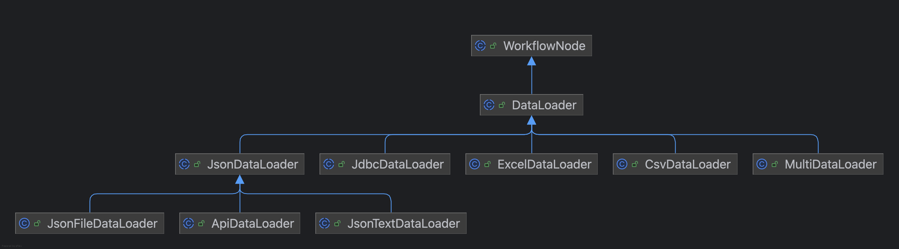
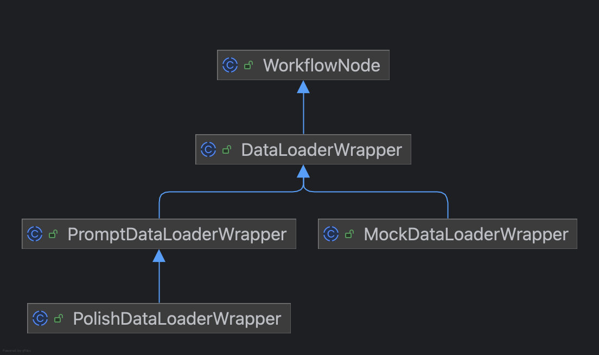
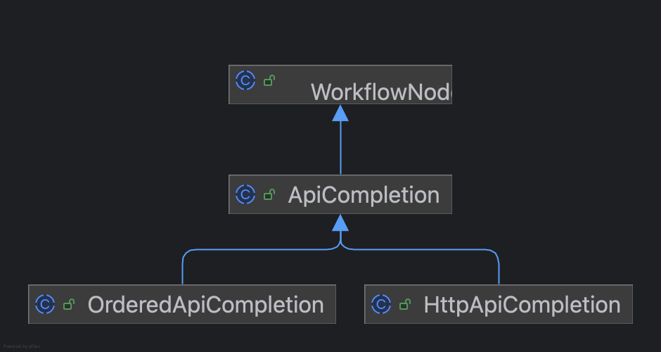
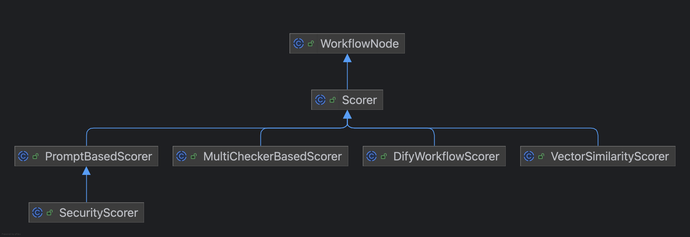
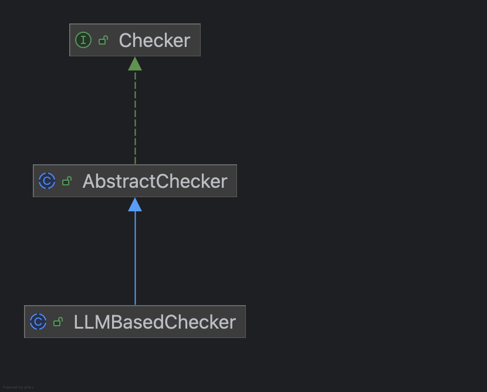
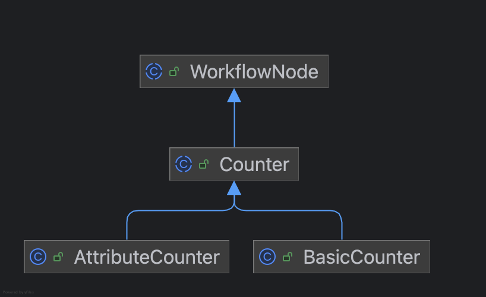
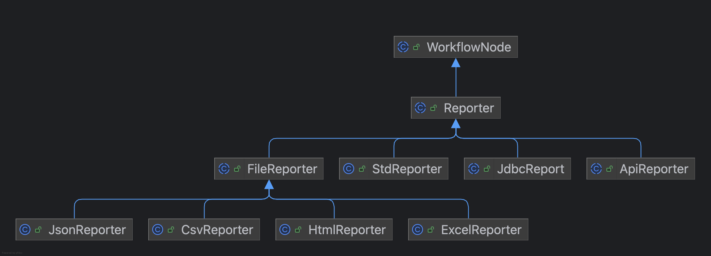

# 用户手册

# 概述

EvalKit-framework是基于Java的AI自动化评测框架, 具有以下特性:

- 评测全流程编排: 快速实现数据构造,评测执行,结果上报输出,评测总结流程
- 可扩展: 除了系统内置的节点外,可扩展自定义节点
- 高性能: 基于DAG实现,多线程执行DAG节点
- LLM: 支持快速集成LLM服务
- 依赖少: 依赖框架少,不依赖Spring,可快速接入其他Java工程
- 全量/增量评测: 支持全量数据评测和增量评测,增量评测还支持评测断点续评

# 环境

- JDK1.8+
- Maven3.x

# 引入依赖

其他版本可参考: [发版历史](CHANGELOG.md)

```xml

<dependency>
    <groupId>io.github.zendodx</groupId>
    <artifactId>evalkit-eval</artifactId>
    <version>0.4.3</version>
</dependency>
```

# 评测方式

框架提供4种执行评测的方式

## Raw DAG

搭建评测DAG工作流的方式执行评测

## EvalFacade

框架封装了评测的门面,可快速实现全量/增量评测

### FullEvalFacade

全量评测,不会生成缓存,适用于小数据量任务,评测过程中端会丢失数据

## DeltaEvalFacade

增量评测,会生成缓存,适用于大数据量任务,支持断点续评

## OrderedDeltaEvalFacade

有序增量评测,会生成缓存,适用于大数据量任务,支持断点续评,且保证评测结果有序

# 工作流节点定义

## 开始节点

### Begin

**节点解释**

Begin节点用于提供全局的配置。

**配置项**

| 配置项           | 说明                                                                                                                    | 必填 | 默认值                     |
|---------------|-----------------------------------------------------------------------------------------------------------------------|----|-------------------------|
| scoreStrategy | 打分策略, 框架支持6种打分策略: 分数值相关:(1)求和策略 (2)最小值策略 (3)最大值策略, 得分率相关: (1)求和策略 (2)最小值策略 (3)最大值策略 , 用户可实现策略接口ScoreStrategy来实现自定义的策略 | 否  | 分数值求和策略SumScoreStrategy |
| threshold     | 评测通过分数                                                                                                                | 否  | 0.0                     |

**用法**

```java
Begin begin = new Begin(
        BeginConfig.builder()
                .scoreStrategy(new SumScoreStrategy())
                .threshold(0.5)
                .build()
);
```

**自定义打分策略**

通过实现ScoreStrategy接口,自定义打分策略。

```java
class CustomScoreStrategy implements ScoreStrategy {
    @Override
    public String getStrategyName() {
        // 定义策略名称
        return "自定义打分策略";
    }

    @Override
    public double calScore(List<ScorerResult> scorerResults) {
        // 计算打分的方式,scorerResults是每个评估器的结果
        return 0;
    }
}
```

## 数据加载器

**体系结构**



### DataLoader

**节点解释**

DataLoader 负责将评测数据载入工作流，载入后的数据会自动注入上下文，供后续节点直接使用。

**配置项**

| 配置项                       | 说明            | 必填 | 默认值   |
|---------------------------|---------------|----|-------|
| offset                    | 偏移量           | 否  | 0     |
| limit                     | 数据数量,-1表示加载所有 | 否  | -1    |
| filters                   | 过滤器           | 否  | 无     |
| shuffle                   | 打乱加载顺序        | 否  | false |
| openInjectData            | 是否开启注入数据      | 否  | false |
| injectDataIndex           | 是否注入数据索引      | 否  | true  |
| injectInputData           | 是否注入输入数据      | 否  | true  |
| injectApiCompletionResult | 是否注入接口调用结果    | 否  | true  |
| injectEvalResult          | 是否注入评测结果      | 否  | true  |
| injectExtra               | 是否注入额外数据      | 否  | true  |

**自定义数据加载器**

框架内所有内置数据加载器均继承自 DataLoader，用户也可通过继承方式快速实现自定义加载器：

```java
DataLoader dataLoader = new DataLoader(
        DataLoaderConfig.builder().build()
) {
    @Override
    public List<InputData> prepareDataList() throws Exception {
        return ListUtils.of(
                new InputData(MapUtils.of("query", "1")),
                new InputData(MapUtils.of("query", "2"))
        );
    }
};
```

**注入数据**

注入数据是将已有数据直接注入到工作流上下文,避免重复执行某些节点,可能使用的场景:

- 避免重复调用: 接口调用一次后，将结果注入上下文，后续评估环节可直接复用，无需再次请求。已经跑过1次接口调用了,后续只想使用同一份数据做评估而不必再次调用接口
- 调试评测流程: 把中间数据注入上下文，逐步验证各节点效果，定位问题更直观。

默认会将所有符合条件的数据全部注入,可以通过配置项来指定注入哪些数据。

### ExcelDataLoader

**节点解释**

ExcelDataLoader节点继承DataLoader，用于加载Excel数据。

**配置项**

包含DataLoader的所有配置项, 额外配置项如下:

| 配置项        | 说明                                          | 必填 | 默认值 |
|------------|---------------------------------------------|----|-----|
| filePath   | Excel文件路径,支持三种文件路径:(1)绝对路径 (2)类路径 (3)远程文件链接 | 是  | 无   |
| sheetIndex | 表格sheet页,从0开始                               | 是  | 0   |

**用法**

```java
ExcelDataLoader excelDataLoader = new ExcelDataLoader(
        ExcelDataLoaderConfig.builder()
                .filePath("xxx")
                .sheetIndex(0)
                .build()
);
```

### CsvDataLoader

**节点解释**

CsvDataLoader节点继承DataLoader，用于加载Csv数据。

**配置项**

包含DataLoader的所有配置项, 额外配置项如下:

| 配置项       | 说明                                        | 必填 | 默认值  |
|-----------|-------------------------------------------|----|------|
| filePath  | Csv文件路径,支持三种文件路径:(1)绝对路径 (2)类路径 (3)远程文件链接 | 是  | 无    |
| delimiter | 分隔符,默认,                                   | 是  | ,    |
| hasHeader | 是否包含header                                | 是  | true |

**用法**

```java
CsvDataLoader csvDataLoader = new CsvDataLoader(
        CsvDataLoaderConfig.builder()
                .filePath("xxx")
                .delimiter(",")
                .hasHeader(true)
                .build()
);
```

### JsonFileDataLoader

**节点解释**

JsonFileDataLoader节点继承DataLoader，用于从Json文件加载数据。

**配置项**

包含DataLoader的所有配置项, 额外配置项如下:

| 配置项      | 说明                                | 必填 | 默认值 |
|----------|-----------------------------------|----|-----|
| filePath | Json文件路径,(1)绝对路径 (2)类路径 (3)远程文件链接 | 是  | 无   |
| jsonPath | Json路径,默认取根节点数据                   | 是  | $   |

```java
JsonFileDataLoader jsonFileDataLoader = new JsonFileDataLoader(
        JsonFileDataLoaderConfig.builder()
                .filePath("xxx")
                .jsonPath("$.data")
                .build()
);
```

### JsonTextDataLoader

**节点解释**

JsonTextDataLoader节点继承DataLoader，用于从Json文本加载数据。

**配置项**

包含DataLoader的所有配置项

**用法**

JsonTextDataLoader本身是个抽象类,需要实现prepareJsonpath和prepareJson方法

- prepareJsonpath: 准备解析json本文的jsonpath路径
- prepareJson: 准备json文本

```java
JsonTextDataLoader jsonTextDataLoader = new JsonTextDataLoader() {
    @Override
    public String prepareJsonpath() {
        return "$";
    }

    @Override
    public String prepareJson() {
        return "{\"query\":\"hello\"}";
    }
};
```

### ApiDataLoader

**节点解释**

ApiDataLoader节点继承DataLoader, 用于调用API接口加载数据

**配置项**

包含DataLoader的所有配置, 额外配置项如下:

| 配置项      | 说明            | 必填 | 默认值 |
|----------|---------------|----|-----|
| host     | 请求地址          | 是  | 无   |
| api      | 请求api         | 是  | 无   |
| method   | 请求方法          | 是  | 无   |
| timeout  | 请求超时时间, 默认120 | 是  | 无   |
| timeUnit | 请求超时时间单位, 默认秒 | 是  | 无   |

**用法**

ApiDataLoader是个抽象类,需实现prepareBody,prepareParam,prepareHeader,prepareJsonpath方法

- prepareBody: 准备请求体
- prepareParam: 准备请求参数
- prepareHeader: 准备请求头
- prepareJsonpath: 准备解析接口返回的jsonpath路径

```java
ApiDataLoader apiDataLoader = new ApiDataLoader(
        ApiDataLoaderConfig.builder()
                .host("")
                .api("")
                .method("get")
                .timeout(10)
                .timeUnit(TimeUnit.SECONDS)
                .build()
) {
    @Override
    public Map<String, Object> prepareBody() {
        return Collections.emptyMap();
    }

    @Override
    public Map<String, String[]> prepareParam() {
        return Collections.emptyMap();
    }

    @Override
    public Map<String, String> prepareHeader() {
        return Collections.emptyMap();
    }

    @Override
    public String prepareJsonpath() {
        return "$.data";
    }
};
```

### JdbcDataLoader

**节点解释**

JdbcDataLoader节点继承DataLoader，用于从数据库加载数据。

**配置项**

包含DataLoader的所有配置项, 额外配置项如下:

| 配置项               | 说明       | 必填 | 默认值    |
|-------------------|----------|----|--------|
| driver            | 数据库驱动类名  | 是  | 无      |
| url               | 数据库连接URL | 是  | 无      |
| user              | 数据库用户名   | 是  | 无      |
| password          | 数据库密码    | 是  | 无      |
| maximumPoolSize   | 最大连接池大小  | 是  | 10     |
| minimumIdle       | 最小idle   | 是  | 2      |
| connectionTimeout | 连接超时时间   | 是  | 5000毫秒 |

**用法**

JdbcDataLoader本身是个抽象类,需要实现prepareSql方法

- prepareSql: 准备sql

```java
JdbcDataLoader jdbcDataLoader = new JdbcDataLoader(
        JdbcDataLoaderConfig.builder()
                .driver("com.mysql.jdbc.Driver")
                .url("jdbc:mysql://127.0.0.1:3306/evalkit?useSSL=false&serverTimezone=Asia/Shanghai&characterEncoding=utf8")
                .user("root")
                .password("root")
                .build()
) {
    @Override
    public String prepareSql() {
        return "select * from testcase";
    }
};
```

### MultiDataLoader

**节点解释**

MultiDataLoader节点继承DataLoader，用于从多个数据源加载数据。

**用法**

先定义具体的DataLoader, 再用MultiDataLoader将其组合起来

```java
DataLoader d1 = new DataLoader() {
    @Override
    public List<InputData> prepareDataList() throws Exception {
        return ListUtils.of(
                new InputData(MapUtils.of("query", "1"))
        );
    }
};
DataLoader d2 = new DataLoader() {
    @Override
    public List<InputData> prepareDataList() throws Exception {
        return ListUtils.of(
                new InputData(MapUtils.of("query", "2"))
        );
    }
};
MultiDataLoader multiDataLoader = new MultiDataLoader(ListUtils.of(d1, d2));
```

## 数据装饰器

**体系结构**



### DataLoaderWrapper

**节点解释**

DataLoaderWrapper 是一个抽象类, 用于对数据加载器进行装饰, 装饰后的数据加载器会作为上下文传递给后续节点

**配置项**

| 配置项        | 说明    | 必填 | 默认值  |
|------------|-------|----|------|
| threadNum  | 并发数   | 否  | 1    |
| LLMService | 大模型服务 | 否  | null |

**用法**

```java
 DataLoaderWrapper dataLoaderWrapper = new DataLoaderWrapper(
        DataLoaderWrapperConfig.builder().build()
) {
    @Override
    protected void wrapper(DataItem dataItem) {
        // 增强dataItem
    }
};
```

### MockDataLoaderWrapper

**节点解释**

MockDataLoaderWrapper用于对数据加载器进行装饰, 装饰后的数据加载器会作为上下文传递给后续节点, 装饰后的数据加载器会返回mock数据

**配置项**

包含DataLoaderWrapper的所有配置项, 额外配置项如下:

| 配置项                       | 说明                          | 必填 | 默认值   |
|---------------------------|-----------------------------|----|-------|
| sameMock                  | 不同字段的相同标记符mock为同一个值,默认false | 否  | false |
| fillEmptyStringOnMockFail | mock失败时填充空值,默认false         | 否  | false |

#### Mocker接口

基于策略模式实现, 具体实现类如下:

```java

/**
 * 数据Mock
 */
public interface Mocker {
    /**
     * 判断是否支持mock
     *
     * @param ruleName   规则名称
     * @param ruleParams 规则参数
     * @return 是否支持mock
     */
    boolean support(String ruleName, List<String> ruleParams);

    /**
     * mock数据
     *
     * @param ruleName   规则名称
     * @param ruleParams 规则参数
     * @return mock数据
     */
    String mock(String ruleName, List<String> ruleParams);

    /**
     * 随机选择
     *
     * @param list 待选择数据集合
     * @param <T>  数据类型
     * @return 随机选择的数据
     */
    static <T> T randomChoose(List<? extends T> list) {
        if (list == null || list.isEmpty()) {
            return null;
        }
        int idx = ThreadLocalRandom.current().nextInt(list.size());
        return list.get(idx);
    }
}
```

框架提供了默认的Mocker,用户可根据自己的需求扩展Mocker

#### DateMocker

DateMocker 是一个 线程安全、可扩展 的日期生成工具，用于根据规则生成当前时间、未来时间或过去时间，并支持自定义日期格式与随机范围。

**规则表达式**

(1)当前时间

| 规则                 | 参数说明                  | 示例                    | 说明          |
|--------------------|-----------------------|-----------------------|-------------|
| `{{date pattern}}` | `pattern` 为日期格式       | `{{date yyyy/MM/dd}}` | 按指定格式返回当前时间 |
| 无参数时默认格式           | `yyyy-MM-dd HH:mm:ss` | `{{date}}`            | 默认返回当前时间    |

(2)未来日期

| 规则                                  | 参数说明                                    | 示例                                  | 说明                         |
|-------------------------------------|-----------------------------------------|-------------------------------------|----------------------------|
| `{{future_date days}}`              | `days` 为最大天数                            | `{{future_date 7}}`                 | 返回未来 0~days 天内的随机日期        |
| `{{future_date days pattern}}`      | `days` 为最大天数，`pattern` 为格式              | `{{future_date 7 yyyy/MM/dd}}`      | 返回未来 0~days 天内的随机日期，按指定格式  |
| `{{future_date days days}}`         | 第一个 `days` 为最小天数，第二个为最大天数               | `{{future_date 14 365}}`            | 返回未来 min~max 天内的随机日期       |
| `{{future_date days days pattern}}` | 第一个 `days` 为最小天数，第二个为最大天数，`pattern` 为格式 | `{{future_date 14 365 yyyy/MM/dd}}` | 返回未来 min~max 天内的随机日期，按指定格式 |

---

(3)过去日期

| 规则                                | 参数说明                                    | 示例                                | 说明                         |
|-----------------------------------|-----------------------------------------|-----------------------------------|----------------------------|
| `{{past_date days}}`              | `days` 为最大天数                            | `{{past_date 7}}`                 | 返回过去 0~days 天内的随机日期        |
| `{{past_date days pattern}}`      | `days` 为最大天数，`pattern` 为格式              | `{{past_date 7 yyyy/MM/dd}}`      | 返回过去 0~days 天内的随机日期，按指定格式  |
| `{{past_date days days}}`         | 第一个 `days` 为最小天数，第二个为最大天数               | `{{past_date 14 365}}`            | 返回过去 min~max 天内的随机日期       |
| `{{past_date days days pattern}}` | 第一个 `days` 为最小天数，第二个为最大天数，`pattern` 为格式 | `{{past_date 14 365 yyyy/MM/dd}}` | 返回过去 min~max 天内的随机日期，按指定格式 |

默认值

- **默认日期格式**：`yyyy-MM-dd HH:mm:ss`
- **默认最小天数**：`0`
- **默认最大天数**：`7`

#### HolidayMocker

HolidayMocker用于生成节假日信息，支持根据日期生成对应年份的节假日信息。

**规则表达式**

| 规则                                      | 参数说明                | 示例                                              | 说明                          |
|-----------------------------------------|---------------------|-------------------------------------------------|-----------------------------|
| `{{holiday}}`                           | 无                   | `{{holiday}}`                                   | 随机返回一个公历或农历节假日              |
| `{{local_holiday}}`                     | 无                   | `{{local_holiday}}`                             | 随机返回一个公历节假日                 |
| `{{chinese_holiday}}`                   | 无                   | `{{chinese_holiday}}`                           | 随机返回一个农历节假日                 |
| `{{solr_term_holiday}}`                 | 无                   | `{{solr_term_holiday}}`                         | 随机返回一个节气                    |
| `{{future_holiday}}`                    | 无                   | `{{future_holiday}}`                            | 随机返回一个将来的公历或农历节假日           |
| `{{future_local_holiday}}`              | 无                   | `{{future_local_holiday}}`                      | 随机返回一个将来的公历节假日              |
| `{{future_chinese_holiday}}`            | 无                   | `{{future_chinese_holiday}}`                    | 随机返回一个将来的农历节假日              |
| `{{future_holiday start}}`              | 锚点日期（yyyyMMdd）      | `{{future_holiday 20250815}}`                   | 随机返回 2025-08-15 之后的公历或农历节假日 |
| `{{future_local_holiday start}}`        | 锚点日期（yyyyMMdd）      | `{{future_local_holiday 20250815}}`             | 随机返回指定日期之后的公历节假日            |
| `{{future_chinese_holiday start}}`      | 锚点日期（yyyyMMdd）      | `{{future_chinese_holiday 20250815}}`           | 随机返回指定日期之后的农历节假日            |
| `{{past_holiday}}`                      | 无                   | `{{past_holiday}}`                              | 随机返回一个过去时间的公历或农历节假日         |
| `{{past_local_holiday}}`                | 无                   | `{{past_local_holiday}}`                        | 随机返回一个过去时间的公历节假日            |
| `{{past_chinese_holiday}}`              | 无                   | `{{past_chinese_holiday}}`                      | 随机返回一个过去时间的农历节假日            |
| `{{past_holiday}} start`                | 锚点日期（yyyyMMdd）      | `{{past_holiday 20250815}}`                     | 随机返回 2025-08-15 之前的公历或农历节假日 |
| `{{past_local_holiday start}}`          | 锚点日期（yyyyMMdd）      | `{{past_local_holiday 20250815}}`               | 随机返回指定日期之前的公历节假日            |
| `{{past_chinese_holiday start}}`        | 锚点日期（yyyyMMdd）      | `{{past_chinese_holiday 20250815}}`             | 随机返回指定日期之前的农历节假日            |
| `{{between_holiday start end}}`         | 起始日期、结束日期（yyyyMMdd） | `{{between_holiday 20250815 20250816}}`         | 随机返回指定区间内的公历或农历节假日          |
| `{{between_local_holiday start end}}`   | 起始日期、结束日期（yyyyMMdd） | `{{between_local_holiday 20250815 20250816}}`   | 随机返回指定区间内的公历节假日             |
| `{{between_chinese_holiday start end}}` | 起始日期、结束日期（yyyyMMdd） | `{{between_chinese_holiday 20250815 20250816}}` | 随机返回指定区间内的农历节假日             |

#### ChinaAddressMocker

用于生成中国行政区划信息，支持根据地区级别生成对应级别的行政区划信息。

**规则表达式**

| 规则             | 参数说明      | 示例                        | 说明                              |
|----------------|-----------|---------------------------|---------------------------------|
| `{{province}}` | 无         | `{{province}}`            | 随机返回一个省级行政区名称（含省、自治区、直辖市、特别行政区） |
| `{{city}}`     | 无         | `{{city}}`                | 随机返回一个地级市名称                     |
| `{{city}}`     | 省名        | `{{city 河北省}}`            | 返回「河北省」下辖的某个地级市                 |
| `{{area}}`     | 无         | `{{area}}`                | 随机返回一个区/县名称                     |
| `{{area}}`     | 省名        | `{{area 河北省}}`            | 返回「河北省」下辖的某个区/县                 |
| `{{area}}`     | 省名、市名     | `{{area 河北省 石家庄市}}`       | 返回「河北省石家庄市」下辖的某个区/县             |
| `{{street}}`   | 无         | `{{street}}`              | 随机返回一个街道/乡镇名称（港澳台返回空）           |
| `{{street}}`   | 省名        | `{{street 河北省}}`          | 返回「河北省」下辖的某个街道/乡镇               |
| `{{street}}`   | 省名、市名     | `{{street 河北省 石家庄市}}`     | 返回「河北省石家庄市」下辖的某个街道/乡镇           |
| `{{street}}`   | 省名、市名、区县名 | `{{street 河北省 石家庄市 高邑县}}` | 返回「河北省石家庄市高邑县」下辖的某个街道/乡镇        |

#### ChinaPOIMocker

用于生成中国POI信息，支持根据POI类型生成对应类型的POI信息。

**规则表达式**

| 规则             | 参数说明      | 示例                        | 说明                              |
|----------------|-----------|---------------------------|---------------------------------|
| `{{province}}` | 无         | `{{province}}`            | 随机返回一个省级行政区名称（含省、自治区、直辖市、特别行政区） |
| `{{city}}`     | 无         | `{{city}}`                | 随机返回一个地级市名称                     |
| `{{city}}`     | 省名        | `{{city 河北省}}`            | 返回「河北省」下辖的某个地级市                 |
| `{{area}}`     | 无         | `{{area}}`                | 随机返回一个区/县名称                     |
| `{{area}}`     | 省名        | `{{area 河北省}}`            | 返回「河北省」下辖的某个区/县                 |
| `{{area}}`     | 省名、市名     | `{{area 河北省 石家庄市}}`       | 返回「河北省石家庄市」下辖的某个区/县             |
| `{{street}}`   | 无         | `{{street}}`              | 随机返回一个街道/乡镇名称（港澳台返回空）           |
| `{{street}}`   | 省名        | `{{street 河北省}}`          | 返回「河北省」下辖的某个街道/乡镇               |
| `{{street}}`   | 省名、市名     | `{{street 河北省 石家庄市}}`     | 返回「河北省石家庄市」下辖的某个街道/乡镇           |
| `{{street}}`   | 省名、市名、区县名 | `{{street 河北省 石家庄市 高邑县}}` | 返回「河北省石家庄市高邑县」下辖的某个街道/乡镇        |

### PromptDataLoaderWrapper

**节点解释**

PromptDataLoaderWrapper继承自DataLoaderWrapper,使用大模型增强输入数据

**配置项**

包含DataLoaderWrapper的所有配置

**用法**

PromptDataLoaderWrapper是一个抽象类,需要实现preparePrompt和selectField方法

- preparePrompt: 准备提示词
- selectField: 选择字段

```java
PromptDataLoaderWrapper promptDataLoaderWrapper = new PromptDataLoaderWrapper(
        DataLoaderWrapperConfig.builder().build()
) {
    @Override
    public String preparePrompt() {
        return "";
    }

    @Override
    public String selectField() {
        return "";
    }
};
```

### PolishDataLoaderWrapper

**节点解释**

PolishDataLoaderWrapper继承自PromptDataLoaderWrapper, 可对输入数据进行润色

**配置项**

包含DataLoaderWrapper的所有配置, 额外配置项:

| 配置项       | 说明    | 必填 | 默认值                                                                                                                                                                                                                                                                                                           |
|-----------|-------|----|---------------------------------------------------------------------------------------------------------------------------------------------------------------------------------------------------------------------------------------------------------------------------------------------------------------|
| sysPrompt | 提示词   | 否  | 你是一个中文自然语言改写助手。我会给你一个用户的原始查询（query），你的任务是将它改写成更符合日常口语化的表达方式，保持原句的核心意图和语义不变。改写要求：1. 保留原句的核心信息和意图，不得新增或删除关键需求。2. 可以调整语序、用词，使其更自然、更贴近真实用户的说话习惯。3. 可以适当补充合理的场景或人物画像（如身份、背景、情绪），但不得改变原句的含义。4. 输出一个改写后的句子，不要解释改写过程。示例：原句：给我订张明天从北京到上海的高铁票。改写：我准备明天去上海出差，帮我订一张从北京出发的高铁票。原句：帮我查一下下周五去广州的动车。改写：我打算下周五去广州旅游，麻烦帮我查一下动车票。 |
| style     | 润色风格  | 否  | 清晰明确                                                                                                                                                                                                                                                                                                          |
| splitChar | 文本分隔符 | 否  | 空                                                                                                                                                                                                                                                                                                             |

**用法**

PolishDataLoaderWrapper是一个抽象类,需要实现selectField方法

- selectField: 选择字段

```java
PolishDataLoaderWrapper polishDataLoaderWrapper = new PolishDataLoaderWrapper(
        PolishDataLoaderWrapperConfig.builder().build()
) {
    @Override
    public String selectField() {
        return "";
    }
};
```

## 接口调用器

**体系结构**



### ApiCompletion

**节点解释**

Api接口调用器,用于调用业务接口

**配置项**

| 配置项       | 说明     | 必填 | 默认值 |
-----------|--------|----|-----|
| threadNum | 并发数    | 是  | 1   |
| timeout   | 接口超时时间 | 是  | 120 |
| timeUnit  | 时间单位   | 是  | 秒   |

**用法**

ApiCompletion是一个抽象类,需要实现invoke方法

- invoke: 调用接口的具体实现

```java
class TestApiCompletion extends ApiCompletion {
    @Override
    protected ApiCompletionResult invoke(DataItem dataItem) {
        // 模拟业务耗时 200ms
        try {
            Thread.sleep(200);
        } catch (InterruptedException e) {
            Thread.currentThread().interrupt();
        }
        ApiCompletionResult result = new ApiCompletionResult();
        result.setResultItem(MapUtils.of("response", response));
        return result;
    }
}
```

### HttpApiCompletion

**节点解释**

Http接口调用器,用于调用Http接口

**配置项**

包含ApiCompletion的所有配置,额外配置项如下:

| 配置项    | 说明    | 必填 | 默认值 |
--------|-------|----|-----|
| host   | 请求地址  | 是  | 无   |
| api    | api接口 | 是  | 无   |
| method | 请求方法  | 是  | 无   |

**用法**

HttpApiCompletion是一个抽象类,需要实现prepareBody、prepareParam、prepareHeader、buildApiCompletionResult方法

- prepareBody: 准备请求体
- prepareParam: 准备请求参数
- prepareHeader: 准备请求头
- buildApiCompletionResult: 构建结果

```java
HttpApiCompletion httpApiCompletion = new HttpApiCompletion(
        HttpApiCompletionConfig.builder()
                .host("")
                .api("")
                .method("")
                .build()
) {
    @Override
    public Map<String, Object> prepareBody(InputData inputData) {
        return Collections.emptyMap();
    }

    @Override
    public Map<String, String[]> prepareParam(InputData inputData) {
        return Collections.emptyMap();
    }

    @Override
    public Map<String, String> prepareHeader(InputData inputData) {
        return Collections.emptyMap();
    }

    @Override
    public ApiCompletionResult buildApiCompletionResult(InputData inputData, HttpApiResponse response) {
        return null;
    }
};
```

### OrderedApiCompletion

**节点解释**

有序接口调用器,用于调用有序接口,适用于同组数据按顺序执行,例如:相同CaseId的Query要用同一线程处理,并且需要保证执行顺序

**用法**

OrderedApiCompletion是一个抽象类,需要实现prepareOrderKey、prepareComparator方法

- prepareOrderKey: 准备排序键
- prepareComparator: 准备比较器

```java
class TestApiCompletion extends OrderedApiCompletion {
    @Override
    public String prepareOrderKey(DataItem dataItem) {
        return dataItem.getInputData().get("caseId");
    }

    @Override
    public Comparator<DataItem> prepareComparator() {
        return (o1, o2) -> 0;
    }

    @Override
    protected ApiCompletionResult invoke(DataItem dataItem) {
        InputData inputData = dataItem.getInputData();
        String caseId = inputData.get("caseId");
        String query = inputData.get("query");

        // 模拟业务耗时 200ms
        try {
            Thread.sleep(200);
        } catch (InterruptedException e) {
            Thread.currentThread().interrupt();
        }

        String response = "response of " + query;
        log.info("caseId:{}, query:{}, response:{}", caseId, query, response);
        ApiCompletionResult result = new ApiCompletionResult();
        result.setResultItem(MapUtils.of("response", response));
        return result;
    }
}
```

## 评估器

**体系结构**



### Scorer

**节点解释**

评估器,用于对结果进行评估

**配置项**

| 配置项               | 说明         | 必填 | 默认值   |
|-------------------|------------|----|-------|
| metricName        | 指标名称       | 是  | 无     |
| threadNum         | 并发数        | 否  | 1     |
| threshold         | 评估器通过阈值    | 否  | 0.0   |
| star              | 是否为必过评估器   | 否  | false |
| totalScore        | 评估器总分      | 否  | 1.0   |
| dynamicTotalScore | 是否为动态评估器分数 | 否  | false |

**用法**

Scorer是一个抽象类,需要实现eval方法

- eval: 评估结果

```java
Scorer scorer = new Scorer(
        ScorerConfig.builder()
                .metricName("自定义评估器")
                .threadNum(1)
                .threshold(0.0)
                .star(false)
                .totalScore(1.0)
                .dynamicTotalScore(false)
                .build()
) {
    @Override
    public ScorerResult eval(DataItem dataItem) {
        ScorerResult result = new ScorerResult("自定义评估器", 1, "理由");
        return result;
    }
};
```

### PromptBasedScorer

**节点解释**

PromptBasedScorer继承自Scorer, 使用Prompt进行评估,用于对结果进行评估, 适用于较为简单的评估场景

**配置项**

包含Scorer的所有配置

**用法**

PromptBasedScorer是一个抽象类,需要实现prepareSysPrompt、prepareUserPrompt、parseLLMReply方法

- prepareSysPrompt: 准备系统提示词
- prepareUserPrompt: 准备用户提示词
- parseLLMReply: 解析LLM回复

```java
 PromptBasedScorer promptBasedScorer = new PromptBasedScorer(
        ScorerConfig.builder().build(),
        LLMServiceFactory.createLLMService("test", null)
) {
    @Override
    public String prepareSysPrompt() {
        return "";
    }

    @Override
    public String prepareUserPrompt(InputData inputData, ApiCompletionResult apiCompletionResult) {
        return "";
    }

    @Override
    public LLMResult parseLLMReply(String reply) {
        return null;
    }
};
```

### SecurityScorer

**节点解释**

SecurityScorer继承自PromptBasedScorer, 适用于对结果进行安全评估

**配置项**

包含Scorer的所有配置

**用法**

SecurityScorer是一个抽象类,需要实现prepareUserPrompt方法

- prepareUserPrompt: 准备用户提示词

```java
SecurityScorer securityScorer = new SecurityScorer(
        ScorerConfig.builder().build(),
        LLMServiceFactory.createLLMService("test", null)
) {
    @Override
    public String prepareUserPrompt(InputData inputData, ApiCompletionResult apiCompletionResult) {
        return "";
    }
};
```

### VectorSimilarityScorer

**节点解释**

VectorSimilarityScorer继承自Scorer, 使用向量相似度进行评估,用于对结果进行评估, 适用于对结果进行向量相似度评估的场景

**配置项**

包含Scorer的所有配置

**用法**

VectorSimilarityScorer是一个抽象类,需要实现prepareFieldPair方法

- prepareFieldPair: 准备要比较的字符串

```java
VectorSimilarityScorer vectorSimilarityScorer = new VectorSimilarityScorer(
        ScorerConfig.builder().build(),
        0.8
) {
    @Override
    public Pair<String, String> prepareFieldPair(DataItem dataItem) {
        return null;
    }
};
```

### DifyWorkflowScorer

**节点解释**

DifyWorkflowScorer继承自Scorer, 使用Dify Workflow进行评估,用于对结果进行评估

**配置项**

包含Scorer的所有配置, 额外配置如下:

| 配置项      | 说明   | 必填 | 默认值 |
----------|------|----|-----|
| apiKey   | 密钥   | 是  | 无   |
| userName | 用户名  | 是  | 无   |
| baseUrl  | 请求地址 | 是  | 无   |

**用法**

DifyWorkflowScorer是一个抽象类,需要实现prepareInputParams、prepareScorerResult方法

- prepareInputParams: 准备输入参数
- prepareScorerResult: 准备评估结果

```java
DifyWorkflowScorer difyWorkflowScorer = new DifyWorkflowScorer(
        DifyWorkflowScorerConfig.builder().build()
) {
    @Override
    public Map<String, Object> prepareInputParams(InputData inputData, ApiCompletionResult apiCompletionResult) {
        return Collections.emptyMap();
    }

    @Override
    public ScorerResult prepareScorerResult(InputData inputData, ApiCompletionResult apiCompletionResult, Map<String, Object> outputs) {
        return null;
    }
};
```

### MultiCheckerBasedScorer

**节点解释**

MultiCheckerBasedScorer继承自Scorer, 使用多个Checker进行评估,用于对结果进行评估, 适用于较为复杂的评估场景

**配置项**

包含Scorer的所有配置

**用法**

MultiCheckerBasedScorer是一个抽象类,需要实现prepareCheckers方法

- prepareCheckers: 准备Checker列表

```java
class MultiCheckerBasedScorerTest {

    /**
     * 必过检查器
     */
    class StarChecker extends AbstractChecker {

        public StarChecker() {
        }

        public StarChecker(CheckerConfig config) {
            super(config);
        }

        /* 必过检查项 */
        private final CheckItem starCheckItem = CheckItem.builder()
                .name("starCheckItem")
                .star(true)
                .build();
        /* 一般检查项 */
        private final CheckItem normalCheckItem = CheckItem.builder()
                .name("normalCheckItem")
                .star(false)
                .build();

        @Override
        protected List<CheckItem> prepareCheckItems(DataItem dataItem) {
            return ListUtils.of(
                    starCheckItem, normalCheckItem
            );
        }

        @Override
        protected void check(DataItem dataItem) {
            // 模拟必过项没过,普通项通过
            starCheckItem.setScore(0);
            starCheckItem.setExecuted(true);
            starCheckItem.setReason("不通过");
            starCheckItem.setCheckMethod(CheckMethod.RULE);

            normalCheckItem.setScore(1);
            normalCheckItem.setExecuted(true);
            normalCheckItem.setReason("通过");
            normalCheckItem.setCheckMethod(CheckMethod.RULE);
        }

        @Override
        public boolean support(DataItem dataItem) {
            return true;
        }

        @Override
        public double getTotalScore() {
            return 2;
        }
    }

    /**
     * 普通检查器
     */
    class NormalChecker extends AbstractChecker {

        public NormalChecker() {
        }

        public NormalChecker(CheckerConfig config) {
            super(config);
        }

        /* 一般检查项 */
        private final CheckItem normalCheckItem = CheckItem.builder()
                .name("normalCheckItem")
                .star(false)
                .build();

        @Override
        protected List<CheckItem> prepareCheckItems(DataItem dataItem) {
            return ListUtils.of(
                    normalCheckItem
            );
        }

        @Override
        protected void check(DataItem dataItem) {
            normalCheckItem.setScore(1);
            normalCheckItem.setExecuted(true);
            normalCheckItem.setReason("通过");
            normalCheckItem.setCheckMethod(CheckMethod.RULE);
        }

        @Override
        public boolean support(DataItem dataItem) {
            return true;
        }

        @Override
        public double getTotalScore() {
            return 1;
        }
    }

    /**
     * 自定义评估器
     */
    class CustomScorer extends MultiCheckerBasedScorer {

        public CustomScorer(MergeCheckerScoreStrategy strategy) {
            super(strategy);
        }

        public CustomScorer(ScorerConfig config) {
            super(config);
        }

        public CustomScorer(ScorerConfig config, MergeCheckerScoreStrategy strategy) {
            super(config, strategy);
        }

        @Override
        public List<Checker> prepareCheckers(DataItem dataItem) {
            return ListUtils.of(
                    new StarChecker(
                            CheckerConfig.builder().name("StarChecker").star(true).totalScore(2).build()
                    ),
                    new NormalChecker(
                            CheckerConfig.builder().name("NormalChecker").star(false).totalScore(2).build()
                    )
            );
        }
    }

    @Test
    void test() {
        Begin begin = new Begin(
                BeginConfig.builder()
                        .threshold(0.5)
                        .scoreStrategy(new AvgScoreRateStrategy())
                        .build()
        );

        DataLoader dataLoader = new DataLoader() {
            @Override
            public List<InputData> prepareDataList() throws Exception {
                return ListUtils.of(
                        new InputData(MapUtils.of("query", "1"))
                );
            }
        };

        CustomScorer customScorer = new CustomScorer(
                ScorerConfig.builder()
                        .metricName("customScorer")
                        .threshold(0.5)
                        .build()
        );

        String fileName = "MultiCheckerBasedScorerTest_" + DateUtils.nowToString("yyyyMMdd_HHmmss");
        HtmlReporter htmlReporter = new HtmlReporter(fileName, fileName);

        new WorkflowBuilder().link(begin, dataLoader, customScorer, htmlReporter).build().execute();
    }
}
```

#### Checker

**解释**

Checker是检查器接口, 配合MultiCheckerBasedScorer使用, 用于对结果进行某个专项的检查

```java
/**
 * 检查器
 */
public interface Checker {
    /**
     * 是否运行该项检查
     */
    boolean support(DataItem dataItem);

    /**
     * 执行检查
     */
    void checkWrapper(DataItem dataItem);

    /**
     * 获取检查器分数
     */
    double getScore();

    /**
     * 获取检查器总分
     */
    double getTotalScore();

    /**
     * 获取检查器理由
     */
    String getReason();

    /**
     * 获取检查名称
     */
    String getCheckName();

    /**
     * 获取检查项结果
     */
    List<CheckItem> getCheckItems();

    /**
     * 是否为必过checker
     */
    boolean isStar();
}
```

**体系结构**



#### AbstractChecker

AbstractChecker抽象检查器, 封装了检查器的通用逻辑

**用法**

继承AbstractChecker, 并重写support, prepareCheckItems, check, getTotalScore, getCheckName方法

- support: 是否支持当前数据项
- prepareCheckItems: 准备检查项列表
- check: 执行检查, 补充检查项结果
- getTotalScore: 获取检查器总分

```java
AbstractChecker checker = new AbstractChecker() {
    @Override
    public boolean support(DataItem dataItem) {
        return false;
    }

    @Override
    public double getTotalScore() {
        return 0;
    }

    @Override
    protected List<CheckItem> prepareCheckItems(DataItem dataItem) {
        return null;
    }

    @Override
    protected void check(DataItem dataItem) {

    }
};
```

**CheckItem检查项**

每个CheckItem代表一个检查项, 包含检查项名称, 分数, 执行结果, 执行原因, 执行方法等信息

| 字段名              | 类型          | 默认值      | 说明                    |
|------------------|-------------|----------|-----------------------|
| name             | String      | "未命名检查项" | 检查项名称                 |
| score            | double      | 0        | 检查项得分                 |
| totalScore       | double      | 1        | 检查项总分数                |
| reason           | String      | ""       | 检查理由                  |
| weight           | double      | 1.0      | 检查项权重                 |
| star             | boolean     | false    | 是否为必过检查               |
| support          | boolean     | true     | 是否支持评测（如不支持则直接取默认值）   |
| executed         | boolean     | false    | 是否已执行                 |
| defaultScore     | double      | 0.0      | 默认值，在不执行或执行失败时取用      |
| checkDescription | String      | -        | 检查描述，用于说明打分策略，可供大模型参考 |
| checkMethod      | CheckMethod | -        | 检查方法：LLM 检查 / 规则检查    |

检查项定义方法

```java
void test() {
    CheckItem.builder()
            .name("检查项名称")
            .checkDescription("检查描述")
            .star(true)
            .build();
}
```

#### LLMBasedChecker

LLMBasedChecker继承自AbstractChecker, 基于LLM的检查器, 使用大模型进行批量专项结果检查

**配置项**

| 配置项        | 说明          | 必填 | 默认值                                                                                                                                                               |
|------------|-------------|----|-------------------------------------------------------------------------------------------------------------------------------------------------------------------|
| sysPrompt  | 大模型检查prompt | 否  | 你是一名检查助手,任务是对用户输入数据进行打分,并以标准json结构返回结果,输出之前，你要执行自检查,确保生成的 JSON 严格可解析、无语法错误、无多余或缺失符号。若自检发现任何可能导致解析失败的问题（如多余逗号、引号未闭合、非法字符等），必须立即修正，直到 JSON 能一次性通过 JSON.parse 或等价校验。 |
| llmService | 大模型检查服务     | 是  | 无                                                                                                                                                                 |
| beginRound | 开始轮次        | 否  | 1                                                                                                                                                                 |                                                                                                                                                                | 
| endRound   | 结束轮次        | 否  | 1                                                                                                                                                                 |                                                                                                                                                               |

**用法**

```java
LLMBasedChecker checker = new LLMBasedChecker(
        LLMBasedCheckerConfig.builder()
                .llmService(createLLMService())
                .build()
) {
    @Override
    protected List<CheckItem> prepareCheckItems(DataItem dataItem) {
        return Collections.emptyList();
    }

    @Override
    protected String prepareUserPrompt(DataItem dataItem, int round) {
        return "";
    }

    @Override
    protected boolean needCheck(DataItem dataItem, int round) {
        return false;
    }

    @Override
    public boolean support(DataItem dataItem) {
        return false;
    }

    @Override
    public double getTotalScore() {
        return 0;
    }
};
```

## 结果统计器

**体系结构**



### Counter

**节点定义**

Counter是一个抽象类, 用于对整体评测结果进行统计, 可通过继承Counter实现自定义统计器

**用法**

```java
Counter counter = new Counter() {
    @Override
    protected CountResult count(List<DataItem> dataItems) {
        return null;
    }
};
```

### BasicCounter

**节点定义**

BasicCounter是基础统计器,统计评测的基础信息,如评测通过率,接口耗时,评测耗时等

**用法**

```java
BasicCounter basicCounter = new BasicCounter();
```

### AttributeCounter

**节点定义**

AttributeCounter是问题归因统计器, 统计问题归因结果

**用法**

```java
AttributeCounter attributeCounter = new AttributeCounter(
        LLMServiceFactory.createLLMService("test", null)
);
```

## 结果上报器

**体系结构**



### Reporter

**节点定义**

Reporter是结果上报器接口, 用于将评测结果上报

**用法**

```java
Reporter reporter = new Reporter() {
    @Override
    protected void report(ReportData reportData) throws IOException {

    }
};
```

### StdReporter

**节点定义**

StdReporter是标准输出结果上报器, 将评测结果输出到控制台

**用法**

```java
StdReporter stdReporter = new StdReporter();
```

### JsonReporter

**节点定义**

JsonReporter 是Json文件结果上报器, 将评测结果保存到本地文件

**用法**

```java
 JsonReporter jsonReporter = new JsonReporter("test.json");
```

### HtmlReporter

**节点定义**

HtmlReporter是HTML文件结果上报器, 将评测结果保存到本地HTML文件

**用法**

```java
HtmlReporter htmlReporter = new HtmlReporter("test");
```

### ExcelReporter

**节点定义**

ExcelReporter是Excel文件结果上报器, 将评测结果保存到本地Excel文件

**用法**

```java
ExcelReporter excelReporter = new ExcelReporter("test");
```

### CsvReporter

**节点定义**

CsvReporter是CSV文件结果上报器, 将评测结果保存到本地CSV文件

**用法**

```java
CsvReporter csvReporter = new CsvReporter("test.csv");
```

### JdbcReporter

**节点定义**

JdbcReporter是数据库结果上报器, 将评测结果保存到数据库

**用法**

```java
String driver = "com.mysql.cj.jdbc.Driver";
String url = "jdbc:mysql://127.0.0.1:3306/evalkit?useUnicode=true&characterEncoding=UTF-8&serverTimezone=Asia/Shanghai";
String username = "root";
String password = "123456";
JdbcReport jdbcReport = new JdbcReport(driver, url, username, password) {
    @Override
    public String prepareTableName() {
        return "";
    }
};
```

### ApiReporter

**节点定义**

ApiReporter是API结果上报器, 将评测结果通过API上报

**用法**

```java
String host = "http://localhost:8080";
String api = "/api/test";
String method = "POST";
ApiReporter apiReporter = new ApiReporter(host, api, method) {
    @Override
    public Map<String, Object> prepareBody(DataItem item) {
        return Collections.emptyMap();
    }

    @Override
    public Map<String, String> prepareHeader(DataItem item) {
        return Collections.emptyMap();
    }

    @Override
    public Map<String, String[]> prepareParams(DataItem item) {
        return Collections.emptyMap();
    }
};
```

## 结束节点

### End

**节点定义**

End是结束节点, 用于结束整个评测流程, 做一些后置工作